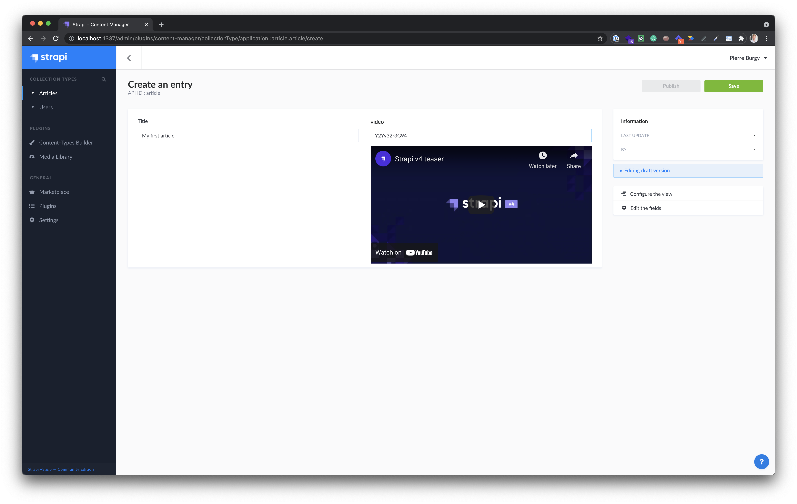

# Strapi application

This is a basic demo of a YouTube custom field for Strapi.

Disclaimers:

- The custom field API is not stable yet.
- Valdations (eg. `required: true`) are not supported.

# Setup

1. Clone this repository.
2. Run `cd strapi-field-youtube`.
3. Run `yarn`.
4. Run `yarn develop`.
5. Open http://localhost:1337/admin.
6. Create your first admin user.
7. Create a first article.
8. In the `video` field, insert a YouTube video id (eg. `Y2Yv32r3G94` from https://www.youtube.com/watch?v=Y2Yv32r3G94).
9. Save your article.
